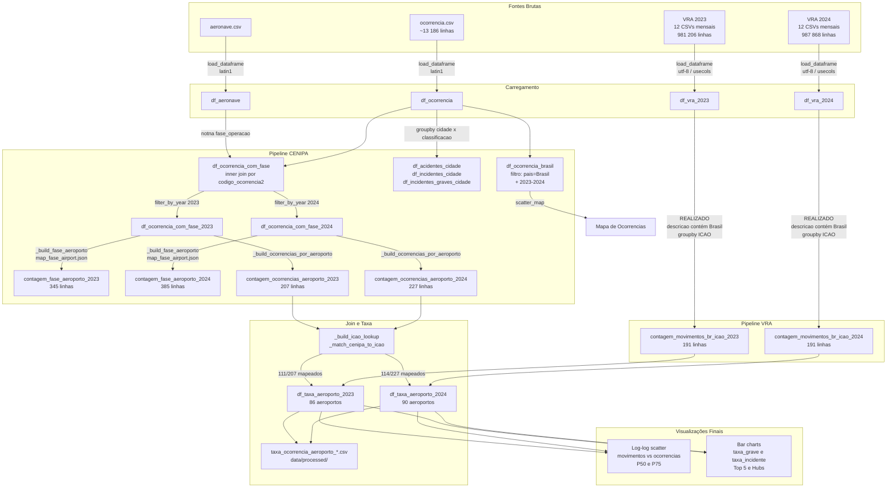

# sprint1-mvp
MVP desenvolvido na primeira sprint da especialização em ciência de dados e analytics da puc rio

---

## Contexto e Hipóteses

### Objetivo

O projeto investiga a **segurança da aviação brasileira** cruzando dois conjuntos de dados públicos:

- **CENIPA/FAB** — base de ocorrências aeronáuticas (acidentes, incidentes graves e incidentes) registrada pelo Centro de Investigação e Prevenção de Acidentes Aeronáuticos desde 2007.
- **VRA/ANAC** — dados de voos regulares (Registro de Voos em Rota) de 2023 e 2024, com granularidade de voo individual e situação de execução.

A pergunta central é: **aeroportos com maior volume de tráfego apresentam proporcionalmente mais ocorrências, ou há um efeito de diluição — mais voos por ocorrência?**

### Hipóteses investigadas

1. **Incidentes dominam a contagem** e cresceram de forma visível de 2023 para 2024, enquanto acidentes permaneceram estáveis — sugerindo maior notificação ou maior pressão operacional, não necessariamente maior risco estrutural.
2. **Aeroportos de alta movimentação tendem a apresentar menor taxa de ocorrência por voo** (efeito de diluição), com grandes hubs como Guarulhos e Galeão potencialmente entre os mais seguros em termos relativos.
3. **A fase de operação da aeronave no momento da ocorrência determina qual aeroporto é o relevante** — fases de subida/decolagem apontam para a origem; fases de descida/pouso apontam para o destino.
4. **O critério de identificação de aeroporto brasileiro pelo texto ANAC** ("Brasil" na descrição) é mais abrangente do que o prefixo ICAO `SB`, pois cobre aeródromos com prefixos `SN*`, `SS*` e outros.

---

## Dimensionamento dos DataFrames Brutos

### Dados carregados diretamente das fontes

| DataFrame | Shape | Fonte | Encoding | Separador |
|---|---|---|---|---|
| `df_vra_2023` | 981 206 × 8 | 12 CSVs mensais VRA 2023 (jan–dez) | UTF-8 | `;` |
| `df_vra_2024` | 987 868 × 8 | 12 CSVs mensais VRA 2024 (jan–dez) | UTF-8 | `;` |
| `df_ocorrencia` | ~13 186 × 22 | `ocorrencia.csv` (CENIPA/FAB) | latin1 | `;` |
| `df_aeronave` | não impresso | `aeronave.csv` (CENIPA/FAB) | latin1 | `;` |

As 8 colunas retidas do VRA via `usecols` são: ICAO da empresa, nome da empresa, assentos, ICAO de origem, descrição do aeroporto de origem, ICAO de destino, descrição do aeroporto de destino e `Situação Voo`.

### Dataframes intermediários e analíticos (shapes conhecidos)

| DataFrame | Shape | Origem |
|---|---|---|
| `contagem_movimentos_br_icao_2023` | 191 × 3 | VRA 2023, REALIZADO, aeroportos BR |
| `contagem_movimentos_br_icao_2024` | 191 × 3 | VRA 2024, REALIZADO, aeroportos BR |
| `contagem_ocorrencias_aeroporto_2023` | 207 × 3 | CENIPA, fase × aeroporto, 2023 |
| `contagem_ocorrencias_aeroporto_2024` | 227 × 3 | CENIPA, fase × aeroporto, 2024 |
| `df_taxa_aeroporto_2023` | 86 × n | Join CENIPA × VRA (111/207 mapeados) |
| `df_taxa_aeroporto_2024` | 90 × n | Join CENIPA × VRA (114/227 mapeados) |

> O join CENIPA × VRA resulta em 86–90 aeroportos porque apenas ~54% dos nomes CENIPA foram mapeados a um ICAO VRA. Os ~46% restantes correspondem a aeródromos menores, pistas não cadastradas ou grafias divergentes entre as duas fontes.

---

## Análise Estatística — Total de Movimentos por Aeroporto (VRA 2023 vs 2024)

| Métrica | 2023 | 2024 |
|---|---|---|
| Média | 9.014,10 | 9.066,37 |
| Mediana | 528,00 | 509,00 |
| Desvio Padrão | 29.344,22 | 29.831,08 |

### Interpretação

- A **mediana é ~17x menor que a média** — sinal claro de uma **distribuição fortemente assimétrica à direita**. Um pequeno número de rotas/aeroportos com volume muito alto puxa a média para cima, enquanto a maioria dos registros apresenta valores bem menores.
- O **desvio padrão é ~3x maior que a própria média**, confirmando dispersão extrema: a distribuição está longe de ser normal.
- Os dois anos são estatisticamente muito similares, indicando que o padrão geral se manteve estável entre 2023 e 2024.

> **Conclusão:** A **mediana é a métrica mais representativa** do valor típico neste conjunto, pois a média é fortemente distorcida por poucos aeroportos de grande volume (como Guarulhos e Galeão).

---

## Análise Estatística — Ocorrências por Cidade (CENIPA)

### Acidentes

| Métrica | Valor |
|---|---|
| Média | 1,30 |
| Mediana | 1,0 |
| Desvio Padrão | 0,62 |

Média e mediana próximas, desvio padrão pequeno em relação à média. Distribuição a mais uniforme das três categorias — a maioria das cidades registrou apenas 1 acidente.

### Incidentes Graves

| Métrica | Valor |
|---|---|
| Média | 1,21 |
| Mediana | 1,0 |
| Desvio Padrão | 0,58 |

Padrão muito similar aos acidentes: baixa variância, maioria das cidades com apenas 1 ocorrência.

### Incidentes

| Métrica | Valor |
|---|---|
| Média | 17,75 |
| Mediana | 2,0 |
| Desvio Padrão | 49,37 |

Destaque pela discrepância extrema: a **mediana é 2, mas a média é 17,75** (quase 9x maior), e o **desvio padrão (49,37) é ~3x a própria média**. Distribuição fortemente assimétrica à direita — poucas cidades (provavelmente grandes centros) concentram a grande maioria dos incidentes.

### Interpretação Geral

- Acidentes e incidentes graves são **uniformemente raros** por cidade: a maioria registra apenas 1 ocorrência.
- Incidentes são **altamente concentrados**: poucas cidades dominam a contagem, tornando a média enganosa.

> **Conclusão:** Para incidentes, a **mediana (2)** é a medida central mais adequada. A média (17,75) só faz sentido acompanhada da identificação das cidades outliers.

---

## Pipeline — `contagem_fase_aeroporto_2023` / `2024`

### Objetivo

Contar ocorrências por **fase de operação da aeronave** e **aeroporto relevante** (origem ou destino, dependendo da fase), separadas por ano.

### Etapas

#### 1. Filtrar `df_aeronave` com fase conhecida

```python
df_ocorrencia_fase_voo = df_aeronave[df_aeronave['aeronave_fase_operacao'].notna()]
```

Descarta linhas de `df_aeronave` sem fase de operação preenchida.

#### 2. Fazer merge com `df_ocorrencia`

```python
df_ocorrencia_com_fase = df_ocorrencia.merge(
    df_ocorrencia_fase_voo[['codigo_ocorrencia2', 'aeronave_fase_operacao']],
    on='codigo_ocorrencia2',
    how='inner'
)
```

Associa cada ocorrência à fase de operação da aeronave envolvida. O `inner join` garante que só entram ocorrências que possuem fase identificada.

#### 3. Filtrar por ano

```python
df_ocorrencia_com_fase_2023 = filter_by_year(df_ocorrencia_com_fase, 'ocorrencia_dia', [2023])
df_ocorrencia_com_fase_2024 = filter_by_year(df_ocorrencia_com_fase, 'ocorrencia_dia', [2024])
```

#### 4. Mapear fase → ponta relevante (`map_fase_airport.json`)

Cada fase de operação é mapeada para a coluna de aeroporto que faz sentido para aquela fase:

| Ponta | Fases incluídas |
|---|---|
| `aeronave_voo_origem` | PARTIDA DO MOTOR, DECOLAGEM, SUBIDA, SAÍDA IFR, etc. |
| `aeronave_voo_destino` | DESCIDA, APROXIMAÇÃO FINAL, POUSO, CORRIDA APÓS POUSO, etc. |
| `aeronave_fase_operacao` | CRUZEIRO, TÁXI, MANOBRA, PAIRADO, INDETERMINADA, etc. |

```python
df['ponta'] = df['aeronave_fase_operacao'].map(fase_para_ponta)
```

#### 5. Resolver o aeroporto por linha (`_aeroporto`)

```python
def _aeroporto(row):
    if ponta == 'aeronave_voo_destino':
        val = row['aeronave_voo_destino']
    elif ponta == 'aeronave_voo_origem':
        val = row['aeronave_voo_origem']
    else:
        return 'NAO IDENTIFICADO'
    return val if pd.notna(val) and str(val).strip() not in ('', '***') else 'NAO IDENTIFICADO'
```

Fases sem ponta clara (CRUZEIRO, TÁXI, etc.) resultam em `'NAO IDENTIFICADO'`.

#### 6. Agrupar e contar (`_build_fase_aeroporto`)

```python
df.groupby(['aeronave_fase_operacao', 'ponta', 'aeroporto'], dropna=False)
  .size()
  .reset_index(name='contagem')
  .sort_values(['aeronave_fase_operacao', 'contagem'], ascending=[True, False])
```

#### 7. Resultado final

```python
contagem_fase_aeroporto_2023 = _build_fase_aeroporto(df_ocorrencia_com_fase_2023)
contagem_fase_aeroporto_2024 = _build_fase_aeroporto(df_ocorrencia_com_fase_2024)
```

Cada linha do DataFrame resultante representa uma combinação de **(fase de operação, ponta, aeroporto)** com sua respectiva contagem de ocorrências no ano.

### Esquema do DataFrame resultante

| Coluna | Descrição |
|---|---|
| `aeronave_fase_operacao` | Fase do voo no momento da ocorrência |
| `ponta` | Coluna usada para resolver o aeroporto (`voo_origem`, `voo_destino` ou `fase_operacao`) |
| `aeroporto` | Nome do aeroporto de origem ou destino (ou `NAO IDENTIFICADO`) |
| `contagem` | Número de ocorrências para aquela combinação |

---

## Análise de Taxa de Ocorrência por Aeroporto

### Objetivo

Cruzar dados de ocorrências aeronáuticas (CENIPA) com dados de movimentação de voos (VRA/ANAC) por aeroporto, para calcular a taxa de ocorrência por volume de voos. Pergunta central: aeroportos com mais tráfego têm taxa de ocorrência proporcionalmente maior?

---

### ETL — Pipeline de Cruzamento CENIPA × VRA

#### Fontes de dados

| Fonte | Granularidade | Chave de aeroporto |
|---|---|---|
| CENIPA (`df_aeronave`) | Uma linha por aeronave envolvida em ocorrência | Nome por extenso em português (ex: `"VIRACOPOS"`, `"SALGADO FILHO"`) |
| VRA/ANAC (`df_vra_YYYY`) | Uma linha por voo realizado | Código ICAO (ex: `"SBKP"`, `"SBPA"`) **e** descrição textual (ex: `"Aeroporto Internacional de Viracopos - Brasil"`) |

Os dois datasets não compartilham nenhum identificador de aeroporto diretamente comparável. A coluna `aeronave_voo_origem` / `aeronave_voo_destino` do CENIPA contém nomes por extenso; a coluna `Sigla ICAO Aeroporto Origem/Destino` do VRA contém códigos ICAO de 4 letras. Interseção direta: **0 aeroportos**.

#### Etapa 1 — Extração de ocorrências CENIPA por aeroporto e classificação

Função `_build_ocorrencias_por_aeroporto(df_com_fase)`:

1. Faz merge de `df_ocorrencia_com_fase_YYYY` (que já contém `ocorrencia_classificacao` vinda de `df_ocorrencia`) com `_aeronave_aeroportos` nas colunas `['codigo_ocorrencia2', 'aeronave_fase_operacao']`, para trazer `aeronave_voo_origem` e `aeronave_voo_destino`.
2. Mapeia cada fase de operação para a ponta relevante (`aeronave_voo_origem` ou `aeronave_voo_destino`) via `fase_para_ponta` (mesma lógica de `_build_fase_aeroporto`).
3. Descarta linhas com aeroporto `'NAO IDENTIFICADO'`, nulo, vazio ou `'***'`.
4. Agrupa por `(aeroporto, ocorrencia_classificacao)` e conta.

Resultado: `contagem_ocorrencias_aeroporto_YYYY` com colunas `aeroporto` (nome CENIPA), `ocorrencia_classificacao`, `contagem`.

#### Etapa 2 — Extração de movimentos VRA por aeroporto (chave ICAO)

Função `_group_VRA_BR_icao(df)`:

1. Filtra apenas voos com `Situação Voo == "REALIZADO"`.
2. Usa a coluna `Descrição Aeroporto Origem/Destino` para identificar aeroportos brasileiros (critério: texto contém `"brasil"`, case-insensitive) — mesmo critério do pipeline VRA original, que não assume prefixo ICAO `SB`.
3. Usa a coluna `Sigla ICAO Aeroporto Origem/Destino` como chave do dicionário de saída (em vez da descrição).
4. Acumula `pousos` (voos chegando) e `decolagens` (voos partindo) por ICAO.

Resultado: `contagem_movimentos_br_icao_YYYY` indexado por ICAO, com colunas `pousos`, `decolagens`, `movimentacao_total`.

#### Etapa 3 — Resolução do identificador: nome CENIPA → ICAO

**Problema:** CENIPA usa nomes como `"ANTONIO CARLOS JOBIM / GALEÃO"`; VRA usa `"SBGL"`. Não há coluna de mapeamento direto em nenhuma das duas fontes.

**Solução:** usar a coluna de descrição textual do VRA (`Descrição Aeroporto Origem/Destino`) como ponte, pois ela contém o nome do aeroporto embutido (ex: `"Aeroporto Internacional do Rio de Janeiro/Galeão – Antônio Carlos Jobim - Brasil"`).

Função `_build_icao_lookup(df_vra)`:
- Coleta pares únicos `(ICAO, descrição)` para aeroportos brasileiros de ambos os anos (2023 + 2024 combinados, para máxima cobertura).
- Normaliza as descrições: remove acentos via `unicodedata.NFD`, converte para maiúsculas, remove o sufixo `"- BRASIL"`.
- Retorna dict `{ICAO: descrição_normalizada}`.

Função `_match_cenipa_to_icao(cenipa_name, icao_desc)`:
- Normaliza o nome CENIPA (remove acentos, maiúsculas).
- Separa nomes compostos por `"/"` (ex: `"ANTONIO CARLOS JOBIM / GALEÃO"` → `["ANTONIO CARLOS JOBIM", "GALEAO"]`).
- Para cada ICAO candidato, calcula um score: soma do comprimento de cada parte do nome CENIPA que aparece como substring na descrição normalizada do VRA. Partes com menos de 4 caracteres são ignoradas para evitar falsos positivos.
- Retorna o ICAO com maior score (ou `None` se nenhum candidato pontua).

Exemplo de resolução:

| Nome CENIPA | Partes normalizadas | Descrição VRA (normalizada, truncada) | ICAO resolvido |
|---|---|---|---|
| `VIRACOPOS` | `["VIRACOPOS"]` | `AEROPORTO INTERNACIONAL DE VIRACOPOS` | `SBKP` |
| `SALGADO FILHO` | `["SALGADO FILHO"]` | `AEROPORTO INTERNACIONAL SALGADO FILHO` | `SBPA` |
| `ANTONIO CARLOS JOBIM / GALEÃO` | `["ANTONIO CARLOS JOBIM", "GALEAO"]` | `AEROPORTO INTERNACIONAL DO RIO DE JANEIRO/GALEAO ANTONIO CARLOS JOBIM` | `SBGL` |
| `GOVERNADOR ANDRÉ FRANCO MONTORO` | `["GOVERNADOR ANDRE FRANCO MONTORO"]` | `AEROPORTO INTERNACIONAL DE GUARULHOS GOVERNADOR ANDRE FRANCO MONTORO` | `SBGR` |

O mapeamento é aplicado a `contagem_ocorrencias_aeroporto_YYYY`, adicionando a coluna `icao`. Aeroportos não mapeados são descartados do join.

#### Etapa 4 — Join e cálculo de taxas

Função `_build_taxa_aeroporto(contagem_ocorrencias, contagem_movimentos)`:

1. Descarta linhas com `icao` nulo (aeroportos não mapeados).
2. Pivota `contagem_ocorrencias` por `ocorrencia_classificacao`, usando `icao` como índice → colunas `ACIDENTE`, `INCIDENTE GRAVE`, `INCIDENTE` (valores ausentes preenchidos com 0).
3. Calcula `total_grave = ACIDENTE + INCIDENTE GRAVE` e `total_incidente = INCIDENTE`.
4. Faz inner join com `contagem_movimentos_br_icao_YYYY` na chave ICAO.
5. Calcula as taxas:
   - `taxa_grave = total_grave / movimentacao_total`
   - `taxa_incidente = total_incidente / movimentacao_total`
   - `taxa_total = (total_grave + total_incidente) / movimentacao_total`

Resultado: `df_taxa_aeroporto_YYYY` — uma linha por aeroporto com ocorrências e movimentos mapeáveis em ambas as fontes.

#### Variáveis produzidas

| Variável | Descrição |
|---|---|
| `contagem_ocorrencias_aeroporto_YYYY` | Ocorrências por aeroporto (nome CENIPA) e classificação; coluna `icao` adicionada pelo mapeamento |
| `contagem_movimentos_br_icao_YYYY` | Pousos + decolagens por aeroporto, indexado por ICAO |
| `df_taxa_aeroporto_YYYY` | Join final; colunas `taxa_grave`, `taxa_incidente`, `taxa_total` por aeroporto (ICAO) |

#### Limitações conhecidas

- Aeroportos CENIPA cujo nome não aparece como substring em nenhuma descrição VRA são descartados (aeroportos muito pequenos, nomes abreviados não reconhecíveis, ou aeroportos sem voos comerciais regulares no VRA).
- O mapeamento assume que o par com maior score de substring é o correto. Em casos de nomes ambíguos muito curtos (menos de 4 caracteres por parte), nenhum match é feito deliberadamente.
- Aeroportos presentes no VRA mas sem ocorrências no CENIPA não aparecem em `df_taxa_aeroporto_YYYY` (inner join) — isso é correto, pois a análise é centrada nos aeroportos onde ocorreram eventos.

### Por que scatter log-log e não matriz de correlação

Uma matriz de correlação entre `total_movimentos` e `total_ocorrencias` por aeroporto produziria um r positivo e significativo — mas esse resultado é trivial: aeroportos mais movimentados têm mais ocorrências simplesmente pela maior exposição (efeito de base rate). A correlação não distingue entre "este aeroporto é proporcionalmente perigoso" e "este aeroporto é simplesmente grande".

O scatter log-log responde à pergunta correta: a relação entre movimentos e ocorrências é proporcional? Em escala log-log, uma linha com inclinação 1 representa taxa constante. Pontos acima dessa linha têm taxa maior do que o esperado para seu volume; pontos abaixo têm taxa menor. O desvio em relação à linha de referência é o sinal real de segurança relativa.

### Por que escala logarítmica e não normalização (z-score ou min-max)

**Normalização destrói a relação de proporção** que é exatamente o que se quer medir:

- **Z-score** reancora os dados na média. A distribuição de tamanho dos aeroportos brasileiros é fortemente assimétrica à direita (mediana ~17x menor que a média, conforme análise dos movimentos VRA). Usar z-score em uma distribuição com essa assimetria produz uma escala distorcida e recoloca a média — já identificada como métrica inadequada — como centro implícito da análise.
- **Min-max** ancora nos extremos: Guarulhos recebe valor 1,0 e o menor aeroporto recebe 0,0. Toda a variação entre aeroportos médios fica comprimida em um intervalo estreito, dificultando a leitura das diferenças relevantes.
- **Escala log** preserva as unidades originais (número de voos, número de ocorrências) e a razão `ocorrencias/movimentos`. A distância visual entre aeroportos em log-log é proporcional à diferença relativa entre eles — exatamente o que importa para comparação de risco.

### Por que percentil e não média como limiar de referência

Usar a média nacional como linha de referência no scatter reproduziria o mesmo problema já identificado na análise dos movimentos VRA: a distribuição de tamanho de aeroportos é fortemente assimétrica à direita, com poucos hubs grandes puxando a média para cima. Uma linha de referência baseada na média faria a maioria dos aeroportos pequenos cair abaixo dela por construção matemática — não por mérito de segurança.

Os limiares escolhidos são o **percentil 50** (aeroporto típico — taxa mediana, robusta à assimetria) e o **percentil 75** (limiar de risco elevado). Aeroportos acima da linha P75 têm taxa de ocorrência no quartil superior, independentemente de seu volume de tráfego.

### Por que duas taxas separadas (taxa_grave e taxa_incidente)

Acidentes e incidentes graves têm comportamento estatístico similar: distribuição compacta (IQR baixo), mediana igual a 1, desvio padrão pequeno em relação à média. Agrupá-los em `taxa_grave` preserva a interpretação sem perda de informação.

Incidentes têm distribuição distinta: mediana de 2, mas média de 17,75 (~9x maior) e desvio padrão de 49,37 (~3x a própria média). Poucas cidades/aeroportos concentram a grande maioria dos incidentes. Misturar incidentes com acidentes em uma única taxa ocultaria esse padrão — um aeroporto com muitos incidentes mas zero acidentes teria sua taxa de incidentes diluída pela soma. As duas taxas separadas permitem identificar aeroportos problemáticos em dimensões diferentes de risco.

---

## Pipeline Completo — do Raw aos DataFrames Analíticos

### Visão geral



### Narrativa das etapas

#### Carregamento

`DataFrameOperations.load_dataframe` concatena múltiplos CSVs em um único DataFrame com `ignore_index=True`. Os 24 arquivos VRA (12 por ano) são passados como lista de chaves lógicas do `datasources.json`, que resolve as URLs brutas do GitHub. O VRA usa `encoding="utf-8"` explicitamente para evitar mojibake em acentos; os arquivos CENIPA usam o padrão `latin1`.

#### Filtragem de ocorrências brasileiras

`df_ocorrencia_brasil` filtra por `ocorrencia_pais` ≈ "Brasil" e por ano (2023–2024). É usado exclusivamente para o mapa geográfico `scatter_map`, que exibe cada ocorrência com cor por classificação.

#### Agrupamento por cidade

`df_acidentes_cidade`, `df_incidentes_cidade` e `df_incidentes_graves_cidade` resultam de filtrar `df_ocorrencia_recente` por `ocorrencia_classificacao` e depois `groupby('ocorrencia_cidade').size()`. São a base das estatísticas descritivas por cidade.

#### Pipeline fase × aeroporto

O `inner join` entre `df_ocorrencia` e `df_aeronave` (filtrado para fases não nulas) garante que apenas ocorrências com fase identificada entrem na análise. O mapeamento `map_fase_airport.json` resolve, para cada fase, se o aeroporto relevante é de origem ou destino. `_build_fase_aeroporto` aplica esse mapeamento linha a linha e agrupa por `(fase, ponta, aeroporto)`. `_build_ocorrencias_por_aeroporto` agrega por `(aeroporto, classificação)` — produzindo a entrada para o join com VRA.

#### Join CENIPA × VRA e taxa

`_build_icao_lookup` constrói um dicionário de nome CENIPA → ICAO usando os dados VRA como referência. `_match_cenipa_to_icao` aplica esse dicionário às contagens de ocorrências. O join com `contagem_movimentos_br_icao_*` produz `df_taxa_aeroporto_*` com colunas `movimentacao_total`, `total_ocorrencias`, `taxa_grave` e `taxa_incidente` por aeroporto/ano.

---

## Estatísticas Descritivas Enriquecidas

### VRA — Movimentos por aeroporto

Os ~981k e ~987k voos brutos do VRA incluem rotas internacionais e domésticas. Após filtrar por `Situação Voo == "REALIZADO"` e exigir que pelo menos uma ponta da rota tenha descrição contendo "Brasil", chegamos a **191 aeroportos ICAO distintos** por ano — uma redução drástica que reflete a concentração do tráfego aéreo brasileiro regular em poucos hubs.

A disparidade entre média (~9.000) e mediana (~520) confirma essa concentração: os aeroportos de cauda longa (Guarulhos, Galeão, Congonhas, Brasília, Confins) respondem por uma fatia desproporcional dos movimentos, enquanto a maioria dos 191 aeroportos opera em volume muito menor.

### CENIPA — Matching ICAO

Do total de aeroportos com ocorrências registradas no período (207 em 2023, 227 em 2024), apenas ~54% foram mapeados a um ICAO presente no VRA (111 e 114, respectivamente). Os ~46% não mapeados correspondem a:

- Aeródromos privados ou de aviação geral sem operações regulares VRA
- Grafias divergentes entre o campo CENIPA e as descrições VRA
- Localidades sem código ICAO padronizado na base ANAC

Isso significa que `df_taxa_aeroporto_*` representa principalmente **aviação comercial regular** — o segmento com melhor cobertura em ambas as fontes.

---

## Decisões de Análise e Alternativas

| Decisão | Justificativa | Alternativa descartada |
|---|---|---|
| **Scatter log-log** (movimentos × ocorrências) | Comprime 3+ ordens de magnitude numa escala legível; revela proporcionalidade visualmente sem distorção por outliers | Scatter linear: Guarulhos/Galeão dominam o eixo e tornam os demais aeroportos invisíveis |
| **Linhas de referência P50 e P75** no scatter | Dividem os aeroportos em quadrantes interpretáveis (alto tráfego seguro vs. arriscado) sem depender de limiares arbitrários | Thresholds fixos: valores absolutos sem contexto distribucional |
| **`taxa_grave` e `taxa_incidente` separadas** | Acidentes/graves e incidentes têm severidade e taxas base muito diferentes; a separação preserva o sinal de cada dimensão de risco | Taxa combinada: ocultaria aeroportos com muitos incidentes mas poucos acidentes, e vice-versa |
| **Filtro "Brasil" na descrição ANAC** para identificar aeroporto brasileiro | Cobre prefixos ICAO não-SB (`SN*`, `SS*`, `SWXX`, etc.) comuns na aviação regional e geral | Prefixo `SB` apenas: excluiria ~15–20% dos aeródromos brasileiros cadastrados no VRA |
| **`inner join`** entre ocorrencia e aeronave (por fase) | Garante que apenas ocorrências com fase conhecida entrem na análise de fase × aeroporto | `left join`: introduziria linhas com fase nula que propagariam `NaN` nos groupbys seguintes |
| **Mediana como medida central** para incidentes por cidade | Média (17,75) é fortemente distorcida por poucos outliers; mediana (2,0) representa a cidade típica | Média apenas: enganosa para distribuições assimétricas à direita com desvio padrão > média |
| **`map_fase_airport.json` externo** para resolver ponta | Separa a lógica de domínio do código; facilita ajustes sem tocar no notebook | Condicional `if/elif` hardcoded no notebook: frágil e difícil de auditar |

---

## Construção do Notebook — Bibliotecas e Recursos

### Bibliotecas utilizadas

| Biblioteca | Uso principal |
|---|---|
| `pandas` | Todo o ETL: `merge`, `groupby`, `pivot_table`, `str.contains`, `to_datetime`, `value_counts`, `apply` |
| `plotly.express` (alias `ptex`) | `scatter_map`, `bar` (horizontal e agrupado); `map_style="carto-positron"` sem necessidade de token |
| `plotly.graph_objects` (`go`) | Scatter log-log com duas séries (2023/2024), linhas de referência P50/P75 via `add_hline` |
| `matplotlib.pyplot` | Gráfico de pizza (distribuição por classificação) e barra empilhada (evolução anual) |
| `numpy` | Cálculos de percentil para as linhas de referência do scatter |
| `json` | Leitura de `map_fase_airport.json` e `datasources.json` |
| `pathlib.Path` | Resolução de caminhos portável entre execução no root do repo e no diretório `source/` |
| `collections.defaultdict` | Contagem incremental de movimentos por aeroporto |

### Recursos e padrões notáveis

- **`DataFrameOperations.load_dataframe`** — wrapper sobre `pd.read_csv` que concatena múltiplos arquivos com `ignore_index=True`, aplicando `sep`, `encoding` e `usecols` uniformemente. VRA requer `encoding="utf-8"` explícito; o padrão da classe é `latin1` (correto para CENIPA).
- **`filter_by_year(df, col, years)`** — utilitário em `dataframe_operations.py` que filtra um DataFrame por ano a partir de uma coluna de data já convertida para `datetime`.
- **`scatter_map` vs `scatter_mapbox`** — o notebook usa `ptex.scatter_map` (introduzido no Plotly ≥ 5.15), que substitui o `scatter_mapbox` depreciado e não requer token Mapbox para estilos abertos.
- **`map_fase_airport.json`** — tabela de lookup externa que mapeia cada fase de operação (`aeronave_fase_operacao`) à coluna de aeroporto relevante (`aeronave_voo_origem` ou `aeronave_voo_destino`). Desacopla a lógica de domínio do código Python.
- **`sys.path` dinâmico** — o notebook adiciona `Path.cwd()` e `Path.cwd() / "source"` ao `sys.path` para que `from utils...` funcione independentemente de o kernel ser iniciado no root do repositório ou dentro de `source/`.
- **Exportação para `data/processed/`** — `df_taxa_aeroporto_*` e `contagem_movimentos_br_*` são exportados como CSV via `PROCESSED_DIR` definido em `paths.py`, separando dados intermediários dos dados brutos.

---

## Estrutura do Projeto

```
sprint1-mvp/
├── source/
│   ├── mvp.ipynb                    # notebook principal de análise
│   └── utils/
│       ├── dataframe_operations.py  # DataFrameOperations, filter_by_year, load_datasource_urls
│       ├── datasources.json         # mapa nome lógico → URL raw GitHub (CENIPA + VRA mensais)
│       ├── map_fase_airport.json    # fase_operacao → ponta (aeronave_voo_origem / destino)
│       ├── paths.py                 # PROCESSED_DIR, CHARTS_DIR
│       └── __init__.py
├── data/
│   ├── raw/
│   │   ├── CENIPA_FAB/              # ocorrencia.csv, aeronave.csv (e outros não usados)
│   │   └── VRA/
│   │       ├── 2023/                # VRA_2023_01.csv … VRA_2023_12.csv
│   │       └── 2024/                # VRA_2024_01.csv … VRA_2024_12.csv
│   └── processed/                   # taxa_ocorrencia_aeroporto_{2023,2024}.csv
│                                    # contagem_movimentos_br_{2023,2024}.csv
├── charts/                          # figuras geradas (diretório versionado com .gitkeep)
├── analysis.md                      # este documento
├── PROJECT_CONTEXT.md               # referência rápida para contexto de IA e novos devs
└── README.md                        # descrição do projeto
```

### Papel de cada componente

| Caminho | Papel |
|---|---|
| `source/mvp.ipynb` | Toda a análise: carga, limpeza, ETL, visualizações e exportação |
| `utils/dataframe_operations.py` | Abstração de carga de CSV e filtragem por ano |
| `utils/datasources.json` | Ponto único de verdade para URLs das fontes de dados |
| `utils/map_fase_airport.json` | Lógica de domínio: qual ponta do voo é relevante para cada fase |
| `utils/paths.py` | Constantes de diretório para saídas do notebook |
| `data/raw/` | Espelhos locais dos CSVs (notebook pode ler via URL remota ou local) |
| `data/processed/` | DataFrames exportados prontos para consumo externo ou relatório |
| `charts/` | Destino de figuras salvas (não populado automaticamente ainda) |
